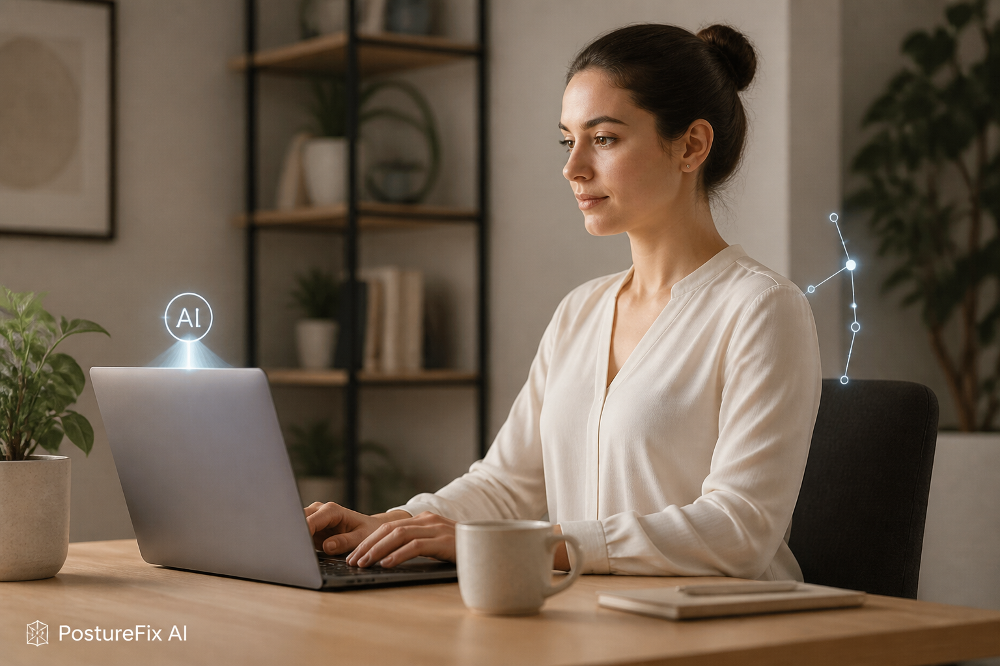

# 💡 PostureFix AI --- Personalized AI Posture Monitor

A real-time, webcam-based posture monitoring system that learns each
user's individual sitting posture through a short calibration process,
builds a personalized K-Nearest Neighbors (KNN) classifier, and provides
stable live posture feedback.



## Table of Contents

-   [The Team](#-the-team)
-   [Project Description](#-project-description)
-   [Getting Started](#-getting-started)
-   [Prerequisites](#-prerequisites)
-   [Installing](#️-installing)
-   [Testing](#-testing)
-   [Deployment](#-deployment)
-   [Built With](#️-built-with)
-   [Acknowledgments](#-acknowledgments)

## 👥 The Team

**Team Members** - Shirel Mimoun - Ester Fradkin

**Supervisor** - Gal Katzhendler

## 📚 Project Description

PostureFix AI is a personalized posture-monitoring system designed to
detect poor sitting posture during computer use without requiring
wearable sensors. The system uses a standard webcam to observe the
user's head and shoulders, extracts posture-related landmarks and
geometric features, and classifies each frame as **Good** or **Bad**
posture.

Unlike a fixed posture detector, the personalized system first performs
an automatic calibration for each user. During calibration, the user is
guided through examples of good and bad posture. The recorded frames are
automatically labeled and divided into posture segments. MediaPipe Pose
landmarks are then extracted from the frames and converted into
geometric and landmark-based features.

A personalized KNN model is trained using only that user's calibration
data. Hyperparameters are selected using group-based cross-validation,
where `Segment_ID` is used to keep frames from the same recorded posture
segment together and reduce data leakage. A separate set of complete
posture segments is held out for evaluation.

During live monitoring, the same feature-extraction pipeline is applied
to webcam frames. The trained personal model predicts Good or Bad
posture, temporal smoothing prevents unstable frame-by-frame warnings,
and a personalized feedback module attempts to identify the posture
issue and display a corrective message.

### Main Features

-   Automatic webcam-based personalized calibration.
-   Guided **Good** and **Bad** posture examples using reference images.
-   Additional natural-reading calibration segment for collecting
    realistic Good-posture variation.
-   Automatic frame labeling with `Label` and `Segment_ID`.
-   MediaPipe Pose landmark extraction.
-   Geometric posture features based mainly on the head, eyes, ears, and
    shoulders.
-   Personalized KNN classification for each user.
-   Median imputation for missing feature values.
-   Standardization using `StandardScaler`.
-   Segment-based train/test separation.
-   Group-based cross-validation for KNN hyperparameter selection.
-   Evaluation using accuracy, classification reports, confusion
    matrices, and permutation importance.
-   Saving of Bad-posture frames that were incorrectly classified as
    Good for error analysis.
-   Real-time webcam monitoring.
-   Temporal smoothing of posture predictions.
-   Personalized corrective feedback for detected posture problems.

### Posture Feedback

The current feedback module can identify patterns associated with:

-   Uneven/asymmetric shoulders.
-   Rounded upper back / raised shoulders.
-   Head or upper body lowered.
-   Head tilted upward.
-   Raised shoulders.
-   Head leaning left or right.
-   Head turning left or right.
-   Forward-head posture.

Feedback is derived from the user's calibration statistics rather than
from the KNN class label alone.

### Main Components

  --------------------------------------------------------------------------------
  Component                                    Purpose
  -------------------------------------------- -----------------------------------
  `main.py`                                    Entry point and user-specific
                                               pipeline management.

  `calibration/frame_extraction.py`            Runs guided webcam calibration,
                                               records frames, and creates
                                               automatic labels and segment IDs.

  `calibration/create_user_dataset.py`         Runs MediaPipe Pose on calibration
                                               frames and creates the user's Excel
                                               dataset.

  `features/feature_extraction.py`             Extracts geometric posture features
                                               and raw landmark coordinates.

  `training/train_personal_model.py`           Splits data by posture segments,
                                               performs GroupKFold hyperparameter
                                               search, evaluates the model, and
                                               trains the final personal KNN
                                               model.

  `training/permutation_importance.py`         Measures feature importance on the
                                               unseen test split.

  `training/feature_selection_experiment.py`   Supports correlation analysis and
                                               backward feature-selection
                                               experiments across personalized
                                               users.

  `features/posture_feedback.py`               Generates personalized explanations
                                               for detected Bad posture.

  `live/live_monitoring.py`                    Performs real-time feature
                                               extraction, KNN inference, temporal
                                               smoothing, and feedback display.
  --------------------------------------------------------------------------------

### Calibration Output

For each user, the pipeline creates data similar to:

``` text
users/<user_id>/
├── frames/
├── labels.csv
├── calibration_dataset.xlsx
├── landmark_checks/
└── evaluation/
```

The trained model is stored under:

``` text
models/user_models/<user_id>_personal_knn.joblib
```

### Personal Calibration Guidelines

For better calibration quality:

-   Use a simple background with good contrast against your clothing,
    for example a light wall with a dark shirt.
-   Make sure your head, neck, and shoulders remain clearly visible.
-   Use good, even lighting and avoid strong backlighting.
-   During **Good posture** examples, sit naturally and make only small,
    gentle movements that represent realistic variations of healthy
    posture.
-   During **Bad posture** examples, perform the requested posture
    clearly but naturally. Do not exaggerate the movement or move into
    pain or significant discomfort.
-   Keep a clear distinction between Good and Bad examples.
-   Do not remain completely frozen; small natural variations help the
    model learn a realistic range of postures.

## ⚡ Getting Started

These instructions run the personalized PostureFix AI pipeline on a
local machine with a webcam.

### 🧱 Prerequisites

-   Python 3.11
-   A working webcam
-   `pip`
-   A desktop environment capable of displaying OpenCV windows

The project currently depends on the following main Python packages:

-   OpenCV (`opencv-python`)
-   MediaPipe
-   NumPy
-   pandas
-   scikit-learn
-   joblib
-   matplotlib
-   openpyxl

### 🏗️ Installing

Clone the repository:

``` bash
git clone https://github.cs.huji.ac.il/shirlel25/Personalized-PostureFix-AI.git
cd Personalized-PostureFix-AI
```

It is recommended to create a virtual environment:

``` bash
python3.11 -m venv .venv
source .venv/bin/activate
```

Install the required Python packages:

``` bash
pip install opencv-python mediapipe numpy pandas scikit-learn joblib matplotlib openpyxl
```

Make sure the calibration reference images exist in:

``` text
assets/calibration_images/good/
assets/calibration_images/bad/
```

Run the application from the project root:

``` bash
python main.py
```

Enter a user name or ID when prompted. The program then provides the
following options:

1.  Run a new calibration, recreate the dataset, and train a new model.
2.  Recreate the dataset from existing frames and labels and retrain the
    model.
3.  Train or retrain from an existing calibration dataset.
4.  Start live monitoring using an existing personal model.
5.  Switch to a different user.
6.  Exit.

For a new user, choose option **1**. The system will guide the user
through calibration, build the dataset, train and evaluate the
personalized KNN model, save it, and then start live monitoring.

Press **`q`** in an OpenCV camera window to stop the active calibration
or monitoring session.

## 🧪 Testing

The personalized model is evaluated automatically during training.

The dataset is first split by complete `Segment_ID` groups.
Approximately 25% of the posture segments from each label are reserved
as an unseen test set. The remaining segments form the Train/CV pool.

KNN hyperparameters are selected on the Train/CV pool using
`GroupKFold`. The current search evaluates combinations of:

``` text
K: 3, 5, 7, 9, 11, 15, 21, 31, 41, 51
Weights: uniform, distance
Distance metrics: euclidean, manhattan
```

Imputation and scaling are fitted separately inside each
cross-validation fold.

After hyperparameter selection, the selected model is evaluated once on
the held-out test segments. The evaluation folder can contain:

``` text
evaluation/
├── classification_report.txt
├── metrics_summary.csv
├── confusion_matrix.png
├── split_summary.txt
├── hyperparameter_selection/
│   ├── group_cv_search_results.csv
│   └── K_vs_group_cv_accuracy.png
├── feature_importance/
│   ├── permutation_importance.csv
│   └── permutation_importance_top20.png
└── misclassified/
    └── bad_predicted_good/
```

### Sample Test

To perform a complete end-to-end test:

``` bash
python main.py
```

Then:

1.  Enter a new test user ID.
2.  Select **Run new calibration**.
3.  Complete the Good, natural-reading, and Bad posture calibration
    stages.
4.  Verify that `labels.csv` and `calibration_dataset.xlsx` are created.
5.  Verify that training finishes and a `.joblib` personal model is
    saved.
6.  Review the generated evaluation results.
7.  Confirm that live monitoring starts and changes between stable Good
    and Bad states as posture changes.
8.  Check that Bad posture produces an appropriate corrective feedback
    message.

The `landmark_checks` directory can also be inspected to verify that
MediaPipe detected the expected body landmarks in the calibration
frames.

## 🚀 Deployment

The current version is designed as a **local desktop prototype** rather
than a production web or cloud service.

The application runs locally and requires:

-   Access to a webcam.
-   The project source code and Python environment.
-   A completed calibration and trained personal model for the selected
    user.

All personalized calibration data and trained models are stored locally
in the project's `users/` and `models/user_models/` directories.

For future deployment, the pipeline could be packaged as a desktop
application and the calibration, training, and monitoring interfaces
could be integrated into a graphical user interface.

## ⚙️ Built With

-   [Python](https://www.python.org/) --- Main programming language.
-   [OpenCV](https://opencv.org/) --- Webcam capture, calibration
    interface, frame handling, and live visualization.
-   [MediaPipe
    Pose](https://ai.google.dev/edge/mediapipe/solutions/vision/pose_landmarker)
    --- Human pose landmark detection.
-   [scikit-learn](https://scikit-learn.org/) --- KNN classification,
    preprocessing, cross-validation, evaluation, and permutation
    importance.
-   [pandas](https://pandas.pydata.org/) --- Dataset creation and
    manipulation.
-   [NumPy](https://numpy.org/) --- Numerical and geometric
    calculations.
-   [Matplotlib](https://matplotlib.org/) --- Evaluation and
    feature-importance plots.
-   [joblib](https://joblib.readthedocs.io/) --- Serialization of
    trained personalized models.

## 🙏 Acknowledgments

-   The project was developed as part of the Electrical Engineering and
    Computer Science program at the Hebrew University of Jerusalem.
-   Special thanks to project supervisor **Gal Katzhendler** for
    guidance and feedback.
-   Thanks to the participants who contributed posture calibration data
    used during the development and evaluation of the system.
-   The project uses the open-source MediaPipe, OpenCV, and scikit-learn
    ecosystems.
